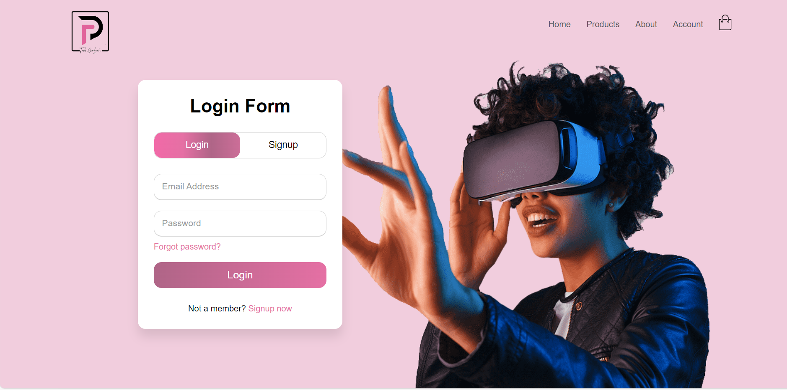

# E-Commerce Application Structure

## About the Project

This is a basic structure for an ecommerce application for the sales of tech gadgets  
This project is solemnly based on html css and js.

## My Personal Experience about this project

I started this application from my own curiosty, I wanted to expand my knowledge more on what i have learnt so far in html css and js,
It's been really helpful in expanding my css skills.

## Technologies Used

- HTML
- CSS
- JavaScript

## UI

## Live Demo

i will host it on netlifly, link will be up soon.

## License

This project is licensed under [MIT LICENSE](LICENSE).

## Contributions

Contributions are welcome! If you have any improvements or new features please open up a pull request or an issue
